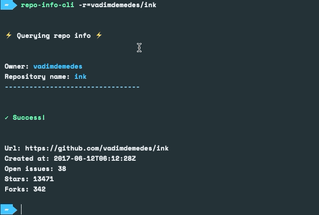

# repo-info-cli

**CLI app to inspect repositories without leaving your terminal. Built with [Ink](https://github.com/vadimdemedes/ink) and [create-ink-app](https://github.com/vadimdemedes/create-ink-app).**



Status and support

- &#x2714; stable
- &#x2714; supported
- &#x2716; no ongoing development

## Installation

### NPM

```sh
npm install --global repo-info-cli
```

### Yarn

```sh
yarn global add repo-info-cli
```

## Development

1. Check the folder out locally.

```sh
git clone git@github.com:gomorizsolt/repo-info-cli.git
```

2. Enter the folder and install the dependencies.

```sh
cd folder/ && npm install
```

3. Make sure everything's up and running.

```sh
node src/index.js --help
```

You can optionally create a [symlink](https://docs.npmjs.com/cli/link) as though the package is installed globally.

```sh
npm link
```

Caveat: this will override any globally installed version of the package.

## License

The project is available as open source under the terms of the MIT License.
